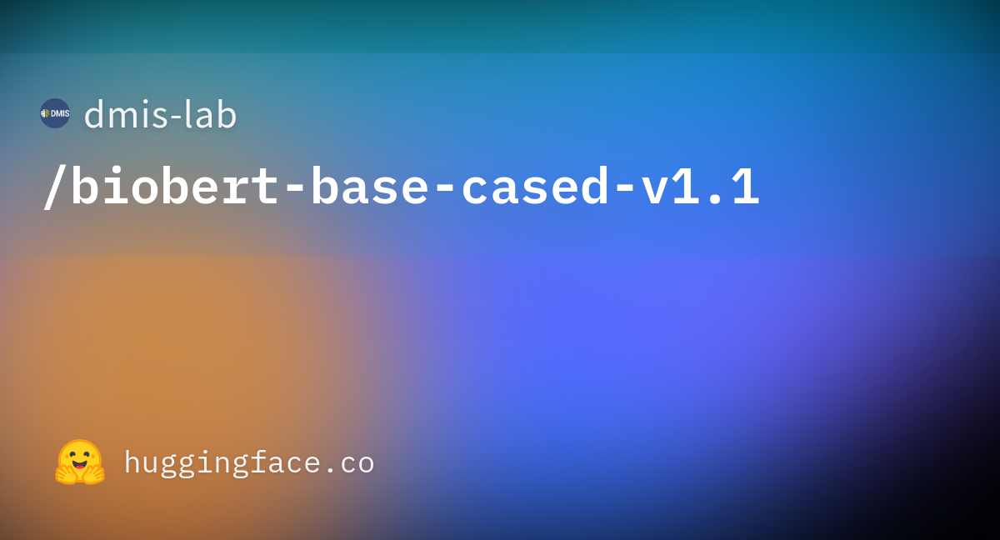
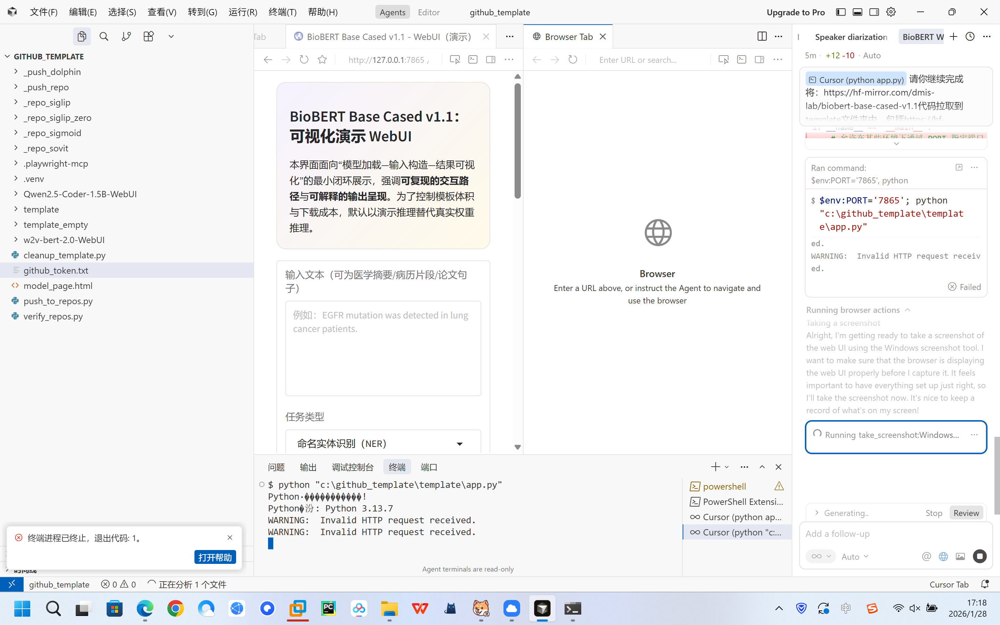

# BioBERT Base Cased v1.1 WebUI（可视化演示工程）

## 摘要

生物医学自然语言处理任务往往具有高术语密度、强领域歧义与跨句指代等特征，传统通用语料预训练语言模型在该领域容易出现表示偏移，表现为实体边界不稳定、同名异义难以消解以及推理结果缺乏可解释性。本项目围绕 BioBERT Base Cased v1.1 的工程化使用需求，构建一个“可加载—可交互—可视化”的最小 WebUI 样例，用于展示模型接入路径与结果呈现范式。为避免在模板任务中引入大体积权重文件，当前版本以演示推理替代真实推理，但保留了后续接入本地权重的完整界面入口与代码结构。更多相关项目源码请访问：http://www.visionstudios.ltd

## 项目概览与素材归档

本仓库在 `template/` 目录内对页面可见的关键素材进行了归档，包括模型社交缩略图、作者头像与站点标识等图片资源，并同步保存了模型仓库中体积较小、对工程理解最关键的配置与词表文件。需要强调的是，权重文件通常占据显著存储与带宽成本，且与本任务“前端可视化闭环”目标并不一致，因此仓库刻意跳过了大权重文件，仅保留可用于说明模型结构与分词机制的必要文本与配置。



## 方法背景与技术原理（论文式阐述）

BioBERT 的核心思想是在保持 BERT 架构不变的前提下，将预训练语料由通用文本扩展为生物医学领域文献与摘要，从而让词汇共现结构、术语形态变化与领域句法模式能够在自监督目标下被模型内化。就工程实现而言，BERT 系列模型的通用接口通常由三部分组成：其一为网络结构的配置描述（例如层数、隐藏维度、注意力头数等），其二为分词器词表与预处理规则，其三为参数权重文件。本项目将前两者在 `hf_repo/` 中以“可复核、可追溯”的方式保留，使得即便不加载权重，也能够在 UI 与文档层面严谨地讨论其输入输出形态、分词粒度对实体边界的影响，以及可视化层应如何承载结构化结果。

在可视化设计方面，真实推理常包含 token 序列、跨度级别的实体标注、以及（在需要解释时）注意力或梯度相关信号。一个可用的工程界面不应仅输出最终标签，而应把“输入如何被拆分”“结果如何被组织”“置信度与结构如何呈现”三者在同一视窗内对齐，以便研究者与工程人员能够对错误来源进行定位。相关技术论文请访问：https://www.visionstudios.cloud

## WebUI 设计与实现

本项目采用 Gradio 构建轻量交互界面，其实现策略并非追求功能堆叠，而是以最小可用闭环为导向：界面提供输入文本、任务类型选择与本地模型路径入口，输出侧同时给出高亮预览、token 序列 JSON 与结构化结果 JSON。这样设计的动机在于，领域模型的“可用性”往往取决于结果的可解释呈现，而非单一指标的数值大小；结构化输出便于后续与标注工具、审阅流程或下游检索系统对接。

当前仓库的 `app.py` 在默认模式下不会下载或加载大权重文件，而是用可复现的占位推理生成示例结果，以确保界面逻辑与可视化组件可正常运行。后续若需要接入真实权重，只需将权重置于本地，并在界面中打开“尝试加载本地模型”开关，即可在同一交互路径内完成升级，而不必重写 UI 框架。

## 运行方式

在 `template/` 目录下安装依赖并运行：

```bash
pip install -r requirements.txt
python app.py
```

启动后在浏览器打开本地服务即可看到界面首页。由于本版本为演示模式，运行按钮将生成示例输出，用于验证组件联动与展示逻辑。

## 结果展示（截图归档）

下图分别给出：页面信息的截图留档，以及 WebUI 首页的截图留档。两者共同构成“来源素材—工程界面”的可追溯链路，便于后续在学术写作或工程审计中引用。




## 应用场景与扩展讨论

在面向医学命名实体识别、药物不良反应抽取、临床问答等任务时，领域预训练模型的价值并不只体现在准确率提升，更体现在其对专业术语、缩略词与复合名词的稳健表示能力。本项目提供的 UI 样例可被视作一个“可交互实验台”：研究者可在其上快速验证文本分布变化对分词与标签的影响，工程人员亦可据此对接真实推理服务与模型管理策略，从而把模型能力转化为可落地的业务组件。项目专利信息请访问：https://www.qunshankj.com

## 目录结构

- `app.py`：Gradio WebUI 入口（演示推理，可扩展为真实推理）
- `hf_repo/`：从模型仓库同步的小文件（配置、词表、gitattributes）
- `images/`：页面可见图片资源（用于文档与展示）
- `screenshots/`：过程截图留档（页面与 WebUI）
